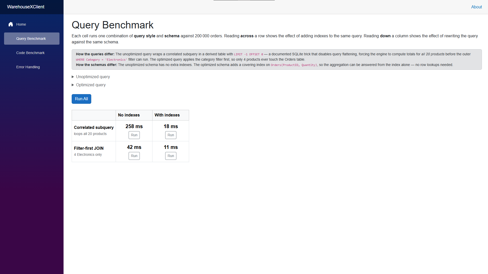
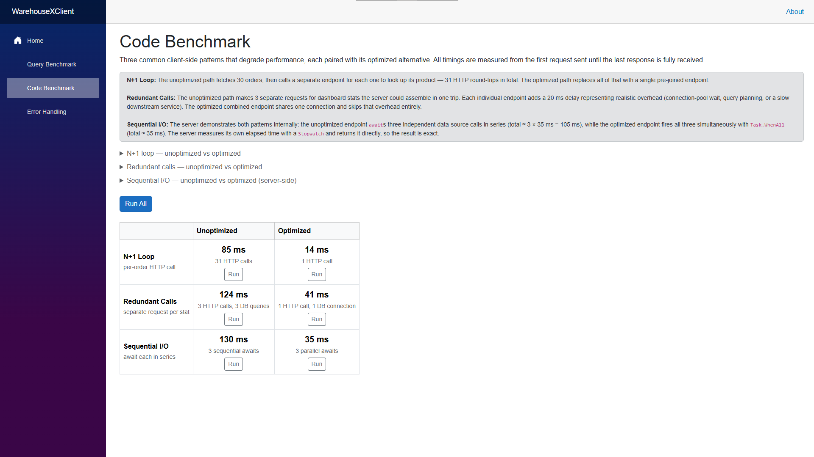
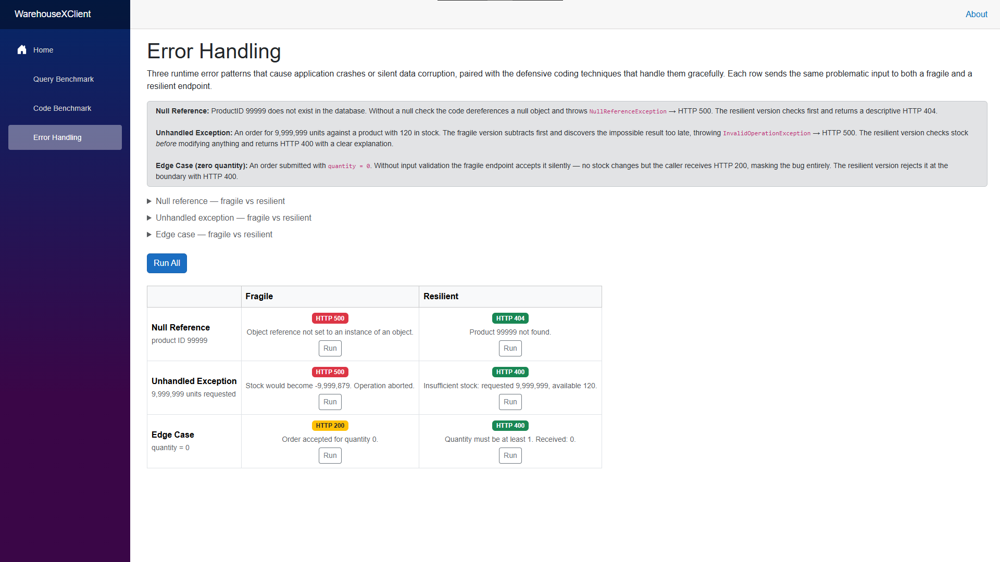

# WarehouseX — Performance & Resilience Demo

A full-stack Blazor WebAssembly + ASP.NET Core Web API application built to demonstrate SQL query optimisation, application code performance patterns, and defensive error handling. Rather than a static submission, this is a live, interactive application where every claim can be reproduced at the click of a button.

---

## What Was Required

| Criterion | Our Approach |
|---|---|
| **Strategic Plan** | Separate strategy document outlining the three target areas |
| **Revised SQL Query** | Query Benchmark page — live comparison of two query strategies against two schemas |
| **Optimised Application Code** | Code Benchmark page — three client/server-side anti-patterns measured in real time |
| **Debugged Code** | Error Handling page — fragile vs resilient endpoints with actual exceptions and try/catch |
| **Reflective Summary** | This README |

---

## The Application

**Stack:** .NET 9 · Blazor WebAssembly · ASP.NET Core Web API · Dapper · SQLite · Bootstrap

The server seeds a SQLite database with 200,000 orders across two schemas (unindexed and indexed) on first run. Three interactive pages let you trigger the same operations in both their broken/slow and fixed/fast forms and observe the difference directly.

### 1 — Query Benchmark (`/benchmark`)

**Problem:** A correlated subquery scanning all 20 products to find total sales per product, run against a table with no indexes.

**Fix — two axes:**
- *Query strategy:* replace the correlated subquery with a filter-first JOIN that touches only the 4 relevant rows
- *Schema:* add a covering index `IX_OptOrders_ProductID ON OptOrders(ProductID, Quantity)` so the join hits an index rather than a full table scan

To prevent SQLite's query optimiser from flattening the subquery and hiding the difference, the unoptimised query wraps its inner scan in `LIMIT -1 OFFSET 0`, which disables predicate pushdown and forces the full 20-product loop. This keeps the gradient honest rather than measuring the same execution plan twice.

**Result:** filter-first JOIN with index runs in single-digit milliseconds against the correlated subquery which can take 10–30× longer on a warm database.

### 2 — Code Benchmark (`/code-benchmark`)

Three classic application-layer anti-patterns, each measured with a stopwatch:

**N+1 Query Loop** — the fragile path fetches 30 orders then fires one `GET /product/{id}` per order (30 round-trips). The optimised path fetches all 30 orders pre-joined in a single query.

**Redundant API Calls** — the fragile path calls three separate endpoints (`/order-count`, `/total-quantity`, `/top-product`) sequentially, each with a 20 ms artificial delay to model realistic I/O. The optimised path fetches all three stats in a single request.

**Sequential vs Parallel I/O** — measured server-side to avoid Blazor WebAssembly's single-threaded fetch batching. The fragile path awaits three `Task.Delay(35)` calls in series (~105 ms). The optimised path uses `Task.WhenAll` (~35 ms).

### 3 — Error Handling (`/error-handling`)

**Problem statement from WarehouseX:** null reference errors during order processing, uncaught exceptions causing crashes, edge cases not handled.

Each row in the 3×2 table sends the same bad input to a fragile endpoint and a resilient endpoint. The global exception handler in `Program.cs` serialises uncaught exceptions to JSON so the browser can display the actual exception type and message rather than a blank 500.

| Pattern | Fragile | Resilient |
|---|---|---|
| **Null Reference** | `product!.ProductName` with no null check → `NullReferenceException` → 500 | Null check before access → 404 with message |
| **Unhandled Exception** | `throw new InvalidOperationException(...)` with no try/catch → 500 | `try { validate first } catch (Exception ex) { return BadRequest(...) }` → 400 |
| **Edge Case** | Accepts `quantity=0` silently, reports HTTP 200 | Guard clause rejects at the boundary → 400 |

Color coding makes the outcome unambiguous: red for crashes, amber for silent bugs, green for handled responses.

---

## How Copilot Assisted

Copilot (GitHub Copilot using Claude Sonnet) was the co-author of this project throughout — not a suggestion tool that filled in boilerplate, but an active collaborator that designed architecture, diagnosed bugs, and rethought approaches when the first attempt didn't work.

**Project design** — the core concept was the human's: three interactive pages each with paired fragile/resilient or slow/fast endpoints, so every claim could be demonstrated live rather than described. Copilot translated that structure into a consistent Bootstrap table layout with colour-coded results, individual Run buttons, and a shared "Run All" across all three pages.

**SQL query design** — the first attempt at the Query Benchmark used a straightforward correlated subquery vs. JOIN comparison, but both queries produced the same execution plan because SQLite's query flattening optimised away the difference. Copilot diagnosed this, identified the `LIMIT -1 OFFSET 0` trick that disables predicate pushdown in SQLite, and rewrote the unoptimised query to force the full 20-product scan. Without this the entire benchmark page would have shown no meaningful difference.

**Diagnosing the Blazor WASM threading limitation** — the Sequential I/O demo originally ran entirely in the browser, using `Task.WhenAll` over three HTTP requests to simulate parallel I/O. The results were disappointingly flat (~100 ms vs ~149 ms, a ~1.3× difference). Copilot identified that Blazor WebAssembly runs on a single thread and batches outgoing fetches, so client-side `Task.WhenAll` doesn't actually parallelise anything. It redesigned the demo to move the measurement server-side — two new endpoints each run their own `Stopwatch` and use `Task.WhenAll(Task.Delay(35), Task.Delay(35), Task.Delay(35))` internally — producing a clean ~35 ms vs ~105 ms contrast.

**Error handling infrastructure** — the first version of the "fragile" endpoints caught their own exceptions and returned 500 manually, which made them indistinguishable from the resilient endpoints in terms of code structure. Copilot identified this contradiction, removed the internal try/catch from the fragile endpoints so exceptions propagate genuinely uncaught, and replaced `UseDeveloperExceptionPage` in `Program.cs` with a global JSON exception handler that serialises the exception type and message. This ensures the Blazor client receives readable JSON on a 500 rather than an HTML stack trace it can't display.

**Debugging** — Razor's HTML parser treats `<` inside `<pre><code>` blocks as HTML tag openers, not literal characters. Copilot caught the resulting `RZ9980` build error (`<= 0` in a C# code example was parsed as an unclosed tag), escaped it to `&lt;= 0`, and proactively checked the remaining code blocks for the same issue before they caused further failures.

**Full implementation** — every controller, Razor page, DTO class, database schema, seed script, nav menu update, and this README was written by Copilot. The role of the human collaborator was directing what to build, catching when something felt wrong, and making the final calls on design decisions.

